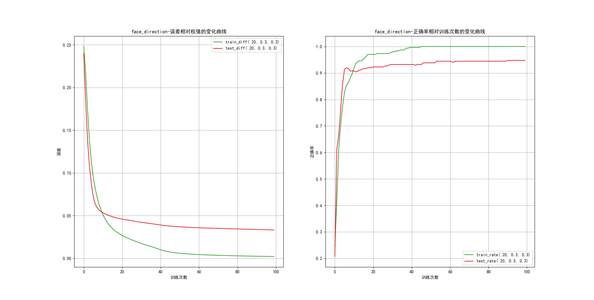

# AI-Experiment
人工智能课的实验作业

## 人脸识别

#### 图片数据
数据参见：http://www.cs.cmu.edu/~tom/mlbook.html

[图片下载](http://www.cs.cmu.edu/afs/cs.cmu.edu/project/theo-8/faceimages/faces_4.tar.Z)

#### 更改路径
更改config.py中的IMGPATH为自己的图片路径

#### python模块
安装所用到的python模块
```
pillow  numpy   matplotlib
```

#### 结果示例：

## genetic_algorithm_for_functional_maximum_problem

参考 https://segmentfault.com/a/1190000004155021